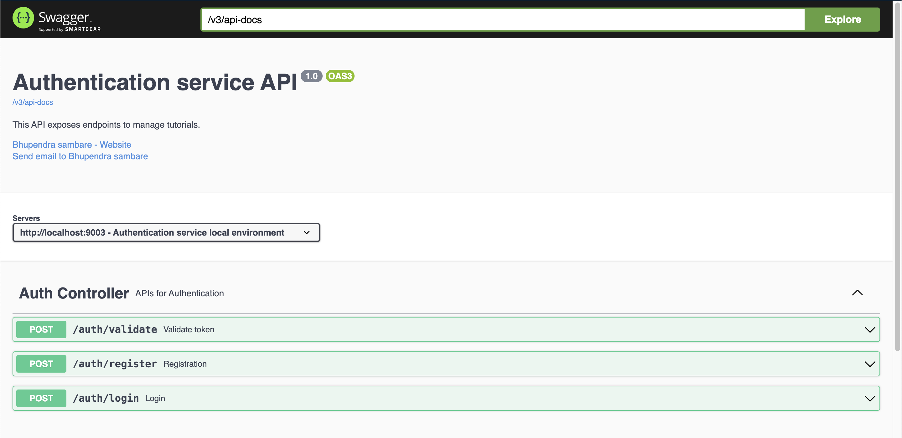

# Microservices Authenticate Service

This project provides an authentication service for microservices, built using Java Spring Boot with Docker and Jenkins integration.

Swagger available at URL: http://localhost:9003/swagger-ui/index.html

## Features

- **User Authentication:** Secure user authentication using JWT.
- **User Management:** APIs for user registr ation and management.
- **Security:** Implements best practices for security.
- **Global exception handling:** Best practice for handling global exceptions with api response
- **Registry Registration:** Register application to eureka registry.
- **Asynchronous messaging:** Producing **Apache Kafka** messages after login success.

## Technologies Used

- Java
- Spring Boot
- MySQL
- JWT security
- Apache kafka
- Docker
- Jenkins

## Getting Started

### Prerequisites

- Java 17
- MySQL
- Apache Kafka
- Microservices registry [Github Porject](https://github.com/bhupendrasambare/microservices-registry)
- Docker
- Maven

### Installation

1. Clone the repository:
    ```bash
    git clone https://github.com/bhupendrasambare/microservices-authenticate-service.git
    cd microservices-authenticate-service
    ```

2. Update the `application.yaml` properties with your custom settings:
    ```yaml
    custom:
      server-ip: 192.168.29.226
    spring:
      kafka:
        bootstrap-servers: ${custom.server-ip}:9092
      datasource:
        url: jdbc:mysql://${custom.server-ip}:3306/microservices?allowPublicKeyRetrieval=true
        driver-class-name: com.mysql.cj.jdbc.Driver
        username: root
        password: password
    ```

3. Build the project using Maven:
    ```bash
    ./mvnw clean install
    ```

4. Run the application:
    ```bash
    java -jar target/microservices-authenticate-service-0.0.1-SNAPSHOT.jar
    ```

### Running with Docker

1. Build the Docker image:
    ```bash
    docker build -t microservices-authenticate-service .
    ```

2. Run the Docker container:
    ```bash
    docker run -d -p 9003:9003 microservices-authenticate-service
    ```

### Jenkins Integration

The project includes a `Jenkinsfile` for CI/CD integration. Ensure Jenkins is set up with Docker and Maven installed.

## Contributing

1. Fork the repository.
2. Create a new branch (`git checkout -b feature-branch`).
3. Make your changes.
4. Commit your changes (`git commit -am 'Add new feature'`).
5. Push to the branch (`git push origin feature-branch`).
6. Create a new Pull Request.

## License

This project is licensed under the MIT License. See the [LICENSE](LICENSE) file for details.

## Contact

For any questions or suggestions, please contact [Bhupendra Sambare](https://github.com/bhupendrasambare).

---

*This project is part of Bhupendra Sambare's repositories on GitHub.*
